**_Because life is too short to redraw diagrams_**

<h1>No Redraw</h1>
NoReDraw is a handy command line java-based tool that converts your source code into diagram<br/><br/>
Have you ever wondered about adding a nice diagram for your architecture? Have you ever had time for that? Are you up for maintaining the diagram for eternity?

No worries, I've got your back. Just run _NoReDraw_ tool against your repo and it will generate diagram of desired type. All local, no internet, no fancy AIs. 

```bash
wget https://github.com/uladzimirFilipchanka/noredraw/raw/main/noredraw.sh && chmod +x noredraw.sh

./noredraw.sh \
--source https://github.com/uladzimirFilipchanka/noredraw-sample.git \
--export MERMAID \
--output ./my-shiny-diagram.txt
```

Now you can insert generated diagram into your comapny's wiki and it will get rendered as an image ([GitHub](https://github.blog/2022-02-14-include-diagrams-markdown-files-mermaid/), [Confluence](https://marketplace.atlassian.com/apps/1222572/mermaid-charts-diagrams-for-confluence?tab=overview&hosting=cloud) and many more support it). 

```mermaid
graph TB
  linkStyle default fill:#ffffff

  subgraph diagram ["My-shiny-diagram"]
    style diagram fill:#ffffff,stroke:#ffffff

    1("<div style='font-weight: bold'>venom27/arch-diagram-sample:latest\n[DockerImage]</div><div style='font-size: 70%; margin-top: 0px'></div><div style='font-size: 80%; margin-top:10px'>path:Dockerfile<br />tag0:venom27/arch-diagram-sample:latest<br />tag1:venom27/arch-diagram-sample:${{env.RELEASE_VERSION}}</div>")
    style 1 fill:#a5d8ff,stroke:#000000,color:#000000
    11("<div style='font-weight: bold'>Dockerfile\n[Dockerfile]</div><div style='font-size: 70%; margin-top: 0px'></div><div style='font-size: 80%; margin-top:10px'>baseImage:eclipse-temurin:17<br />entrypoint:java -jar<br />/app/arch-diagram-sample.jar<br />path:Dockerfile port:80</div>")
    style 11 fill:#a5d8ff,stroke:#000000,color:#000000
    13("<div style='font-weight: bold'>arch-diagram-sample\n[Jar]</div><div style='font-size: 70%; margin-top: 0px'></div><div style='font-size: 80%; margin-top:10px'>targetPath:build/libs/arch-diagram-sample*.jar</div>")
    style 13 fill:#a5d8ff,stroke:#000000,color:#000000
    14("<div style='font-weight: bold'>Gradle</div><div style='font-size: 70%; margin-top: 0px'></div>")
    style 14 fill:#ffc9c9,stroke:#000000,color:#000000
    2("<div style='font-weight: bold'>Github Actions</div><div style='font-size: 70%; margin-top: 0px'></div>")
    style 2 fill:#ffc9c9,stroke:#000000,color:#000000
    4("<div style='font-weight: bold'>app-first-service\n[AmazonECS]</div><div style='font-size: 70%; margin-top: 0px'></div>")
    style 4 fill:#a5d8ff,stroke:#000000,color:#000000
    5("<div style='font-weight: bold'>Terraform</div><div style='font-size: 70%; margin-top: 0px'></div>")
    style 5 fill:#ffc9c9,stroke:#000000,color:#000000
    7("<div style='font-weight: bold'>app-first-task\n[AmazonECSTaskDeployment]</div><div style='font-size: 70%; margin-top: 0px'></div><div style='font-size: 80%; margin-top:10px'>cluster:app-cluster<br />family:app-first-task<br />image:venom27/arch-diagram-sample:latest<br />service:app-first-service</div>")
    style 7 fill:#a5d8ff,stroke:#000000,color:#000000
    9("<div style='font-weight: bold'>FileSystem</div><div style='font-size: 70%; margin-top: 0px'></div>")
    style 9 fill:#ffc9c9,stroke:#000000,color:#000000

    9-. "<div>defines</div><div style='font-size: 70%'></div>" .->7
    9-. "<div>defines</div><div style='font-size: 70%'></div>" .->11
    14-. "<div>builds</div><div style='font-size: 70%'></div>" .->13
    1-. "<div>creates</div><div style='font-size: 70%'></div>" .->11
    4-. "<div>deploys</div><div style='font-size: 70%'></div>" .->7
    7-. "<div>assigns</div><div style='font-size: 70%'></div>" .->1
    11-. "<div>containerize</div><div style='font-size: 70%'></div>" .->13
    2-. "<div>builds</div><div style='font-size: 70%'></div>" .->1
    5-. "<div>provisions</div><div style='font-size: 70%'></div>" .->4
    2-. "<div>prepares</div><div style='font-size: 70%'></div>" .->7
  end
```


<details>
  <summary>Example of the embedded MERMAID diagram</summary>
  

  
</details>

Alternatively NoReDraw can generate good old PNG for you by specifying `--export PNG` (internet connection required)

<h2>Export Formats</h2>
Currently next export formats are supported: 

* PNG
* [Mermaid](https://mermaid.js.org/)
* [Plant UML](https://plantuml.com/) 
* [DOT](https://graphviz.org/doc/info/lang.html)

You can always implement your own Exporter and use it right away. See **Customization** for more details
<h2>Supported providers</h2>

NoReDraw delegates creating of resources to Providers. Providers yield lists of resources, typically generated by parsing specific file types (Dockerfiles, *.tf, etc). These resources then undergo **linking** and **merging** stages.

Currently next providers are supported out of the box: 

* Gradle (basic Jars)
* Docker (parses Dockerfile)
* Terraform AWS (`aws_ecs_service` and `app_service` are supported)
* GitHub Actions ([Docker Build Push Actions](https://github.com/docker/build-push-action) and [AWS ECS Deploy Actions](https://github.com/aws-actions/amazon-ecs-deploy-task-definition))

> **New providers are highly encouraged!** The project is currently in PoC and active development stages, feel free to contribute! 

Alternatively, you can implement your own provider and use it right away. See **Customization** for more details

<h2>Input sources</h2>
You can use the `--source` parameter with either an URL to a public repository or a path pointing to the repo's directory. Private repositories aren't supported right now.

<h2>Customization</h2>
NoReDraw is exteremely simple and highly customizable by design. You can implement your own pieces of the tool, pack them in Jar and use with NoReDraw. 

You can write your own `Provider`, `Exporter`, `MergeStrategy` or `LinkStrategy` in a minutes.<br/>

1. Import `noredraw-core` into your project
```gradle
dependencies {
    implementation 'io.github.uladzimirfilipchanka:noredraw-core:0.0.1'
}
```
2. Implement an interface, for example `LinkStrategy`
```java
@Named("MY_LINKING_STRATEGY")
public class MyCustomMatchLinkStrategy implements LinkStrategy {
    @Override
    public boolean linkable(Relic left, Relic right) {
      return left.getName().equals(right.getName());
    }
}
```
3. Build a Jar, put it under `custom` folder next to `noredraw.jar`.
4. Run `./noredraw` specifying `--link MY_LINKING_STRATEGY`
5. Enjoy

You can find example of the custom prover in [noredraw-custom-example module](https://github.com/uladzimirFilipchanka/noredraw/tree/main/noredraw-custom-example)
